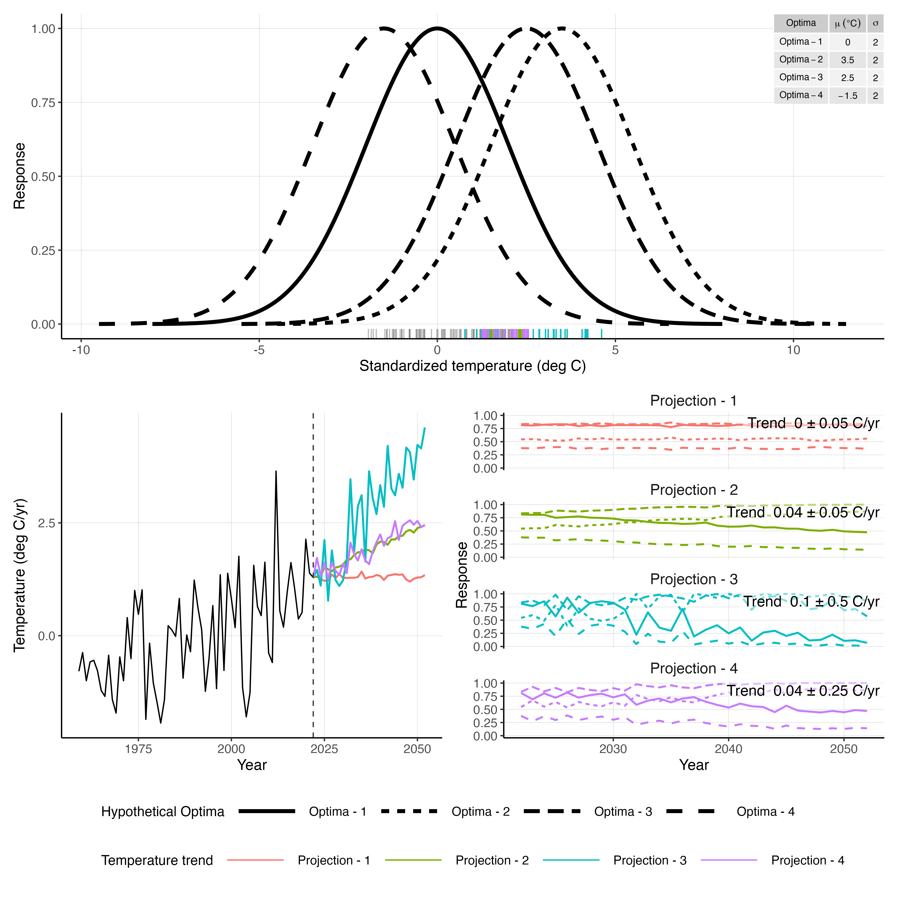

# Methods

## Management strategy evaluation framework

We implemented a management strategy evaluation (MSE) to quantify how alternative estimation model (EM) assumptions about an environmental covariate (Ecov) affect management performance when recruitment in the operating model (OM) is environmentally driven. The MSE consisted of (i) an OM that generates the “true” population and observation data streams, (ii) a set of EMs that are fit at regular intervals to those data, (iii) a harvest control rule (HCR) that converts EM outputs into catch advice, and (iv) an implementation step in which the advised catches are applied back to the OM to update realized fishing mortality and population dynamics. The simulation horizon was 50 years, and assessments were conducted at a 2-year interval. Thus, each assessment produced management advice that was implemented in the OM for the subsequent two years, after which a new assessment was conducted. This assessment–projection–implementation cycle was repeated iteratively until the final assessment year.

To support inference and projections under time-varying environmental conditions, we used North region bottom temperature as Ecov. Because the EM is required to project population dynamics during the feedback period, Ecov values must be specified in forecast years. We therefore defined future temperature trajectories using scenario assumptions (e.g., constant or increasing trajectories), and we distinguished between the “true” Ecov state used by the OM and the observed Ecov time series available to the EM (which includes observation error). Within each stochastic realization, all EMs were applied to the same underlying OM trajectory, allowing within-realization comparison of management performance among EMs. Across realizations, performance was summarized to obtain generalizable conclusions not driven by a single stochastic outcome.

## Population dynamics (WHAM numbers-at-age state process)

Population dynamics followed the Woods Hole Assessment Model (WHAM; Stock & Miller 2021) state-space formulation. Indices follow WHAM convention: year $y=1,\ldots,Y$ and age $a=1,\ldots,A$, where $A$ denotes the plus-group. Let $N_{a,y}$ denote numbers at age $a$ in year $y$. Total mortality is $Z_{a,y}=F_{a,y}+M_{a,y}$, where $F_{a,y}$ is fishing mortality and $M_{a,y}$ is natural mortality. Recruitment is represented by age $a=1$, and mean recruitment can be expressed either through a stock–recruit function $f(\cdot)$ applied to spawning biomass $SSB_{y-1}$ or through a mean-recruitment parameterization, depending on EM structure (defined below).

The WHAM numbers-at-age stock equations (Stock & Miller 2021, Eq. 1) are:

\begin{equation}
\log N_{a,y} =
\begin{cases}
\log\bigl(f(SSB_{y-1})\bigr) + \epsilon_{1,y}, & a=1 \\
\log(N_{a-1,y-1}) - Z_{a-1,y-1} + \epsilon_{a,y}, & 1<a<A \\
\log\bigl(N_{A-1,y-1}e^{-Z_{A-1,y-1}} + N_{A,y-1}e^{-Z_{A,y-1}}\bigr) + \epsilon_{A,y}, & a=A
\end{cases}
\label{eq:wham_naa}
\end{equation}

Spawning stock biomass was computed in the OM and EM using standard age-structured definitions based on numbers-at-age and biological quantities (weight-at-age and maturity-at-age). Unless otherwise stated, selectivity and natural mortality were assumed constant over time in both OM and EM, and therefore did not require additional specification in forecast years.

## Process error in recruitment and numbers-at-age transitions

### Recruitment deviations (AR(1) in the EM)

Recruitment deviations were modeled using the WHAM recruitment deviation notation $\epsilon_{1,y}$. In the EM, recruitment deviations were assumed to follow a stationary AR(1) process with the WHAM default lognormal bias correction:

\begin{equation}
\epsilon_{1,y+1} \sim \mathcal{N}\left(\rho_{\text{year}}\,\epsilon_{1,y} - \frac{\sigma_R^2}{2}\left(1-\rho_{\text{year}}^2\right),\;\sigma_R^2\right),\quad -1<\rho_{\text{year}}<1.
\label{eq:rec_ar1_biascorr}
\end{equation}

This formulation implies temporally autocorrelated recruitment deviations with innovation variance $\sigma_R^2$ on the log scale. The bias correction term ensures the lognormal deviations are mean-corrected on the natural scale under the assumed process.

### Two-sigma structure for recruitment vs. age transitions

To represent distinct sources of variability in recruitment versus subsequent survival/aging transitions, we specified a “two-sigma” process error structure in which recruitment and age transitions use separate variance parameters. Specifically, recruitment deviations (age $a=1$) use $\sigma_R$, while deviations for ages $a>1$ use $\sigma_{\text{NAA}}$:

\begin{equation}
\epsilon_{a,y} \sim
\begin{cases}
\mathcal{N}\left(-\frac{\sigma_R^2}{2},\;\sigma_R^2\right), & a=1 \\
\mathcal{N}\left(-\frac{\sigma_{\text{NAA}}^2}{2},\;\sigma_{\text{NAA}}^2\right), & a>1
\end{cases}
\label{eq:two_sigma}
\end{equation}

This specification matches the goal of using one process-error scale for recruitment and another for numbers-at-age transitions, while retaining WHAM’s lognormal bias correction form.

## Environmental covariate: bottom temperature, observation error, and forecasting

### OM “true” temperature and realization-specific observed series

North region bottom temperature was used as Ecov. In the OM, the historical Ecov state was treated as a deterministic “true” series, denoted $X_y^{\text{true}}$, defined from the North-region temperature state estimated by a previously fitted WHAM model. Because observation data available to the EM should reflect measurement uncertainty, we generated a realization-specific observed Ecov time series by adding observation error to $X_y^{\text{true}}$. For each realization $r$, the observed series $x_y^{(r)}$ was simulated as:

\begin{equation}
x_y^{(r)} \sim \mathcal{N}\left(X_y^{\text{true}},\;\sigma_{\text{obs}}^2\right),
\label{eq:om_ecov_obs}
\end{equation}

where $\sigma_{\text{obs}}$ controls the magnitude of Ecov observation error. This construction ensures that each realization has a unique Ecov observation history while sharing the same underlying deterministic historical forcing.

### Future temperature trajectories (feedback/forecast period)

Because management advice is generated via EM projections, Ecov values are required in forecast years. We therefore specified future temperature trajectories (e.g., constant, increasing, or other scenario patterns) that define $X_y^{\text{true}}$ beyond the terminal assessment year. These scenario-defined future temperatures affected OM recruitment according to the OM recruitment–temperature relationship described below. For EMs that explicitly model Ecov as a latent state-space process, future Ecov values used internally by the EM were generated by continuing the fitted state-space process forward, as described in the EM definitions.

## Operating model recruitment–temperature relationship (Gaussian link, lag 0)

In the OM, recruitment was environmentally driven through a Gaussian (unimodal) temperature response with lag 0. The temperature multiplier was defined as:

\begin{equation}
t_y =
\exp\left[
-\frac{1}{2}\left(\frac{X_y^{\text{true}} - T_{\text{opt}}}{w_{\text{opt}}}\right)^2
\right],
\label{eq:om_gauss_mult}
\end{equation}

where $T_{\text{opt}}$ is the optimal temperature and $w_{\text{opt}}$ controls the width of the response. Recruitment in the OM was then modeled as a mean-recruitment term modified by the Gaussian multiplier and recruitment deviations:

\begin{equation}
\log N_{1,y} = \log(\bar N_1) + \log(t_y) + \epsilon_{1,y},
\label{eq:om_rec_gauss}
\end{equation}

where $\bar N_1$ denotes mean recruitment on the natural scale and $\epsilon_{1,y}$ follows the recruitment deviation process. This OM specification intentionally differs from a linear Ecov effect model; it represents the assumed “true” nonlinear mechanism by which temperature influences recruitment in the simulation.

## Estimation models (management procedures)

We evaluated three estimation models (EMs), each treated as a management procedure (MP) within the MSE. All EMs used the same WHAM numbers-at-age structure (Eq. \eqref{eq:wham_naa}), assumed AR(1) recruitment deviations (Eq. \eqref{eq:rec_ar1_biascorr}), and used the two-sigma process error structure (Eq. \eqref{eq:two_sigma}), unless otherwise specified. The EMs differed in how Ecov was treated and whether recruitment depended on Ecov. The baseline EM was defined as the simplest model (no Ecov), followed by EMs that incorporate Ecov in different ways.

### EM-1 (Linear relationship between recruitment and temperature)

EM-1 uses an existing option in whamMSE where a linear relationship between recrutiment-temperature is estimated. Recruitment is defined as:

\begin{equation}
\log N_{1,y} = \log(\bar N_1) + \beta_RX_{t-\ell} + \epsilon_{1,y}, \epsilon_{1,y} \sim N(0, sigma_R^2)
\label{eq:em3_rec}
\end{equation}

### EM-2 (baseline): no Ecov included

The baseline EM omitted Ecov entirely. Recruitment was modeled with a mean term and recruitment deviations:

\begin{equation}
\log N_{1,y} = \log(\bar N_1) + \epsilon_{1,y}.
\label{eq:em0_rec}
\end{equation}

Because Ecov was not included, EM-0 did not require Ecov values for projection years.

### EM-3 (true-link benchmark): Gaussian recruitment–temperature link with fixed parameters

EM-3 represented a best-case benchmark in which the EM uses the same Gaussian recruitment–temperature relationship as the OM. The Gaussian parameters $(T_{\text{opt}}, w_{\text{opt}})$ were treated as fixed and known in EM-3 (i.e., not estimated). Using the observed Ecov series $x_y$ available to the EM, the multiplier was:

\begin{equation}
t_y^{\text{EM}} =
\exp\left[
-\frac{1}{2}\left(\frac{x_y - T_{\text{opt}}}{w_{\text{opt}}}\right)^2
\right].
\label{eq:em1_gauss_mult}
\end{equation}

Recruitment was then:

\begin{equation}
\log N_{1,y} = \log(\bar N_1) + \log\left(t_y^{\text{EM}}\right) + \epsilon_{1,y}.
\label{eq:em1_rec}
\end{equation}

In forecast years, EM-1 used the scenario-defined “true” future temperature directly (i.e., $x_y=X_y^{\text{true}}$ in projection years), so that projected recruitment reflected the scenario temperature trajectory without additional EM-level filtering.

## Harvest control rule and reference point calculation

Management advice was based on an SPR reference point defined by $F_{40\%}$, the fishing mortality that reduces spawning potential to 40% of its unfished level. The reference point $F_{40\%}$ was calculated internally within each EM using the terminal 5-year averages of weight-at-age (WAA), maturity-at-age (MAA), selectivity, and natural mortality $M$. That is, the EM computed $F_{40\%}$ using biological and fishery inputs fixed at their most recent 5-year mean, which also served as the basis for projections of biological quantities in forecast years. The harvest control rule applied a precautionary buffer such that the target fishing mortality was:

\begin{equation}
F^{\text{HCR}} = 0.75 \times F_{40\%}.
\label{eq:hcr}
\end{equation}

Catch advice was fleet-specific for two fleets. Each EM produced projected fleet-specific catches under the target $F^{\text{HCR}}$, consistent with the EM’s selectivity assumptions and the projection settings described below.

## EM projection settings during the feedback period

At each assessment, the EM was used to project population dynamics forward for the subsequent management period under the HCR target $F^{\text{HCR}}$. Projections incorporated the following assumptions.

Recruitment deviations in the EM continued to evolve as a stationary AR(1) process in forecast years according to Eq. \eqref{eq:rec_ar1_biascorr}. In contrast, numbers-at-age transition random effects for ages $a>1$ were not carried over into forecast years; specifically, for projection years we set $\epsilon_{a,y}=0$ for $a>1$. This ensured that the EM’s forward projections were not conditioned on particular realized age-transition shocks from the terminal assessment year. Biological inputs in forecast years were fixed to terminal 5-year averages for WAA and MAA. Selectivity and natural mortality were assumed constant over time, and therefore did not require additional future specification.

Environmental covariate dynamics in forecast years depended on the EM. EM-0 required no Ecov. EM-1 used scenario-defined true future temperature directly for the Gaussian link. EM-2 propagated Ecov forward using the AR(1) process (Eq. \eqref{eq:em_ecov_ar1}), with the observation model (Eq. \eqref{eq:em_ecov_obs}) defining the relationship between latent states and observed covariate inputs.

The fleet-specific catch advice produced by each EM under these projection settings was then implemented in the OM for the subsequent two years.

## Management feedback loop and implementation in the operating model

The MSE followed a closed-loop feedback design. At each assessment year, simulated observations generated by the OM were input to the EM. The EM was fitted and used to compute $F_{40\%}$ and the HCR target $F^{\text{HCR}}$ (Eq. \eqref{eq:hcr}). The EM then generated two-year projections and produced fleet-specific catch advice corresponding to $F^{\text{HCR}}$. This catch advice was fed back into the OM to determine realized fishing mortality $F_{a,y}^{\text{OM}}$ in the next two years. The OM then updated population dynamics forward using the WHAM numbers-at-age equations (Eq. \eqref{eq:wham_naa}) under the realized $F_{a,y}^{\text{OM}}$, thereby generating the true population trajectory and associated data for the next assessment. This cycle was repeated iteratively until the end of the 50-year horizon.

## Stochastic realizations and performance evaluation

We generated 100 independent stochastic realizationsto quantify uncertainty and ensure that results were not driven by a single stochastic outcome. Each realization represented an independent draw of process and observation errors, including recruitment deviations, numbers-at-age transition deviations, and observation error in the Ecov series (Eq. \eqref{eq:om_ecov_obs}). As a result, each realization produced unique population dynamics and observation datasets.

Within each realization, all three EMs (management procedures) were applied to the same underlying OM trajectory, which enabled within-realization comparisons of management performance among EMs. Performance metrics were recorded for each EM and realization and included spawning stock biomass (SSB), total and fleet-specific catch, and indicators of overfishing (e.g., the probability that realized $F$ exceeded $F_{40\%}$). Metrics were summarized across the 100 realizations to provide robust estimates of expected performance and trade-offs among EM structures under environmentally driven recruitment dynamics.

## Model run analysis/Sensitivity analysis

We conducted a sensitivity analysis to understand how parameterization of

1.  NAA process error: $\sigma_{\text{NAA}}$
2.  Assessment interval (MSE gap): $t_{\text{g}}$
3.  Width of gaussian relationship between temperature and recruitment: $w_{\text{opt}}$

will effect the ability of the different estimation models to generate catch advice and estimate different stock parameters.

We configured different values for each parameter with

1.  $\sigma_{\text{NAA}} = \{0.2, 0.5, 1.0\}$, where 0.2 is realistic for most stocks in the Northeast and 1 is quite high and rather unrealistic
2.  $t_{\text{g}} = \{6\ \text{years}\}$
3.  $w_{\text{opt}} = \{2\}$

### Configuring optima and temperature projections

We configured different optima ($T_{\text{opt}}$) for the hypothetical stock including: -1.5, 0, 2.5, and 3.5.
We configured four different temperature trends for the assessment period 

1. $0.0 ^{\circ}\mathrm{C}\,\mathrm{yr}^{-1} + \epsilon_{y} \ ; \epsilon_{y} \sim \mathcal{N}(0, 0.05)$ - Neutral trend with some stochasticity
2. $0.04 ^{\circ}\mathrm{C}\,\mathrm{yr}^{-1} + \epsilon_{y} \ ; \epsilon_{y} \sim \mathcal{N}(0, 0.05)$ - Historical trend with some stochasticity
3. $0.1 ^{\circ}\mathrm{C}\,\mathrm{yr}^{-1} + \epsilon_{y} \ ; \epsilon_{y} \sim \mathcal{N}(0, 0.05)$ - Trend of the last 10 years with high stochasticity
4. $0.04 ^{\circ}\mathrm{C}\,\mathrm{yr}^{-1} + \epsilon_{y} \ ; \epsilon_{y} \sim \mathcal{N}(0, 0.25)$ - Historical trend with high stochasticity

These configurations are shown in Figure 1 below.

{width="80%"}
